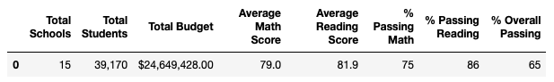
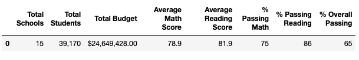

# School District Analysis

## Project Overview
Anomolies have been discovered in the math and reading scores for Thomas High School. This project compares the original results from our district analysis to the reviesed analysis of Thomas High School to determine if the dishonest reporting from Thomas High School has an impact on the overall district summaries:

* Math and Reading scores by grade
* Scores by school spending
* Scores by school size
* Scores by school type

## Resources
The following resources were used to analyize the results:
* Data Sources: PyCitySchools_Challenge_starter_code.ipynb
* Original analysis: PyCitySchools.ipynb

## School District Analysis Results
The implications of academic dishonesty in Thomas High School for ninth grade math and reading scores do not have a significant impact on the original school district assessment. 

### District Summary Impacts
This is the District Summary **BEFORE** Thomas High School 9th grade score changes:

This is the the District Summary **AFTER** Thomas High School 9th grade score changes:

At the District Summary Assessment, the following impacts exist:
* Average Math Scores: -0.1%
* Average Reading Scores: +0.1%
* Overall Passing Math: -0.2%
* All other measures are unchanged

The difference after removing Thomas High School 9th grade scores does not alter this summary. Once rounding is incorported, the scores looks the same.

### School Summary Impacts
This is the School Summary **BEFORE** Thomas High School 9th grade score changes: 

This is the the School Summary **AFTER** Thomas High School 9th grade score changes: 

### 3 How does replacing the ninth-grade scores affect THS peformance relative to other schools
The impact of replacing the 9th grade students' math and reading scored with "NaN" is minimal. It is not enough to invalidate the overall scores of the school or district.

### 4 Math and reading scores by grade
Pics added
