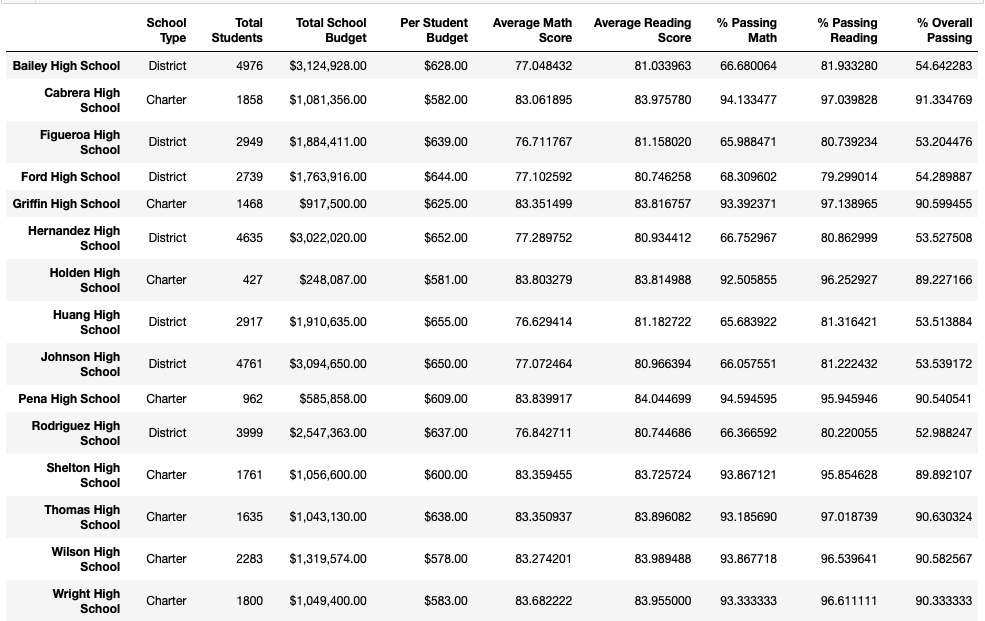

# School District Analysis

## Project Overview
Anomolies have been discovered in the math and reading scores for Thomas High School. This project compares the original results from our district analysis to the revised analysis of Thomas High School to determine if the dishonest reporting from Thomas High School has an impact on the overall district summaries:

* Math and Reading scores by grade
* Scores by school spending
* Scores by school size
* Scores by school type

## Resources
The following resources were used to analyize the results:
* Data Sources: PyCitySchools_Challenge_starter_code.ipynb
* Original analysis: PyCitySchools.ipynb

## School District Analysis Results
The implications of academic dishonesty in Thomas High School for ninth grade math and reading scores do not have a significant impact on the original school district assessment. 

### District Summary Impacts
This is the District Summary **BEFORE** Thomas High School 9th grade score changes:

This is the District Summary **AFTER** Thomas High School 9th grade score changes:

At the District Summary Assessment, the following impacts exist:
* Average Math Scores: -0.1%
* Average Reading Scores: +0.1%
* Overall Passing Math: -0.2%
* All other measures are unchanged

The difference after removing Thomas High School 9th grade scores does not alter this summary. Once rounding is incorported, the scores looks the same.

### School Summary Impacts
This is the School Summary **BEFORE** Thomas High School 9th grade score changes: 

This is the School Summary **AFTER** Thomas High School 9th grade score changes: 

Thomas High School's Summary Impacts:
* Average Math Score: -0.06
* Average Reading Score: +0.05
* % Passing Math: -0.09%
* % Passing Reading: -0.29%
* % Overall Passing: -0.32%

No statistical relevance is present for the overall school score summary changes.

### How does replacing the ninth-grade scores affect THS peformance relative to other schools
The impact of replacing the 9th grade students' math and reading scored with "NaN" is minimal. It is not enough to invalidate the overall scores of the school or district. Thomas High School remains in the Top 5 Schools for the district.

This is the Top 5 Summary **BEFORE** Thomas High School 9th grade score changes: 

This is the School Summary **AFTER** Thomas High School 9th grade score changes: 

### Math and reading scores by grade
A comparison for the math and reading grade demonstrates the scores for all schools and grades are not impacted by removing THS 9th graders from the summary.
#### Math Scores by Grade:
Side by Side Comparison of Original Math Scores and Revised Math Scores with THS 9th Graders Removed:
  

#### Reading Scores by Grade:
Side by Side Comparison of Original Reading Scores and Revised Reading Scores with THS 9th Graders Removed:
  

### School Spending
School Spending is not impacted by the changes to Thomas High School. All measures remaing the same. 

**BEFORE** Thomas High School Changes:

**AFTER** Thomas High School Changes:

### School Size
School size results remains the same as students were not removed, only the scores were removed for Thomas High School 9th graders.

**BEFORE** Thomas High School Changes:

**AFTER** Thomas High School Changes:

### School Type
School type results remains the same as students were not removed, only the scores were removed for Thomas High School 9th graders.

**BEFORE** Thomas High School Changes:

**AFTER** Thomas High School Changes:

## Summary
